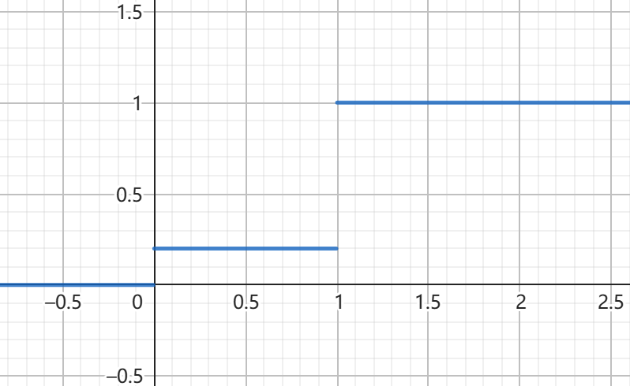
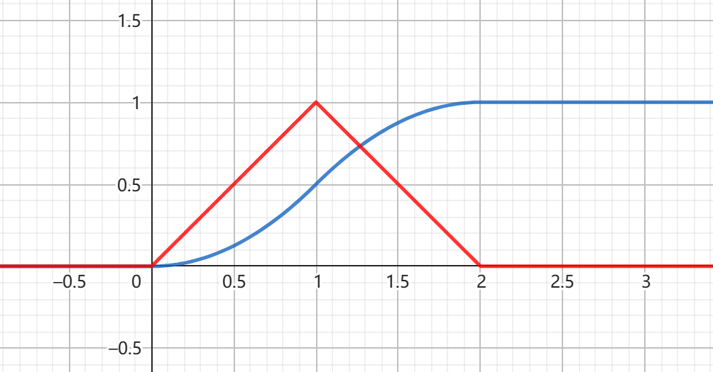

# 2(1)

令随机变量 X 为3个数中的最大值。  
共有$ \binom{5}{3} = 10 $种。

$ X = 3 $ 时 $ P( X = 3 ) = \frac{1}{10} $  
$ X = 4 $ 时 $ P( X = 4 ) = \frac{ \binom{2}{3} }{10} = \frac{3}{10} $  
$ X = 5 $ 时 $ P( X = 5 ) = \frac{ \binom{2}{4} }{10} = \frac{3}{5} $  

X 的分布律为：
| X |    3    |    4    |    5    |
| :---: | :---: | :---: | :---: |
| $P$ | $ \frac{1}{10} $ |  $ \frac{3}{10} $ | $ \frac{3}{5} $  |

# 4

## (1)

$$ P(X = k) = q^{k-1} \times p = (1-p)^{k-1} \times p $$

## (2)

$$ P(Y = k) = \binom{k-1}{r-1}p^rq^{k-r} $$

## (3)

$$ P(X = k) = 0.45 \times 0.55^{k-1} $$

$ P(X 取偶数的概率) = \sum_{k=1}^{\infty} P(X=2k) = \sum_{k-1}^{\infty} 0.45 \times 0.55^{2k-1} = \frac{0.45 \times 0.55}{ 1 - 0.55^2} = \frac{11}{13}  $

# 7

## (1)

令X为A发生的次数。$X \sim b(5,0.3)$  
$P(X \geq 3) = \binom{5}{3}0.3^3(1-0.3)^2 + \binom{5}{4}0.3^4(1-0.3) + 0.3^5=0.163  $

## (2)

$$
P(X \geq 3) = 1 - P(X < 3) = 
1 - \sum_{k=0}^{2} P(k) =
1 - \sum_{k=0}^{2} \binom{7}{k}0.3^k(1-0.3)^{7-k} = 
= 0.353
$$

# 12

$ X \sim \pi(4) $  
$ P(X = k) = \frac{4^ke^{-4}}{k!} $ 

## (1)

$$ P(X=8) = \frac{4^8e^{-4}}{8!} = 0.0298 $$

## (2)

$$ P(X > 3 ) = 1 - \sum_{k=0}^{3} P(X=k) =
1 - \sum_{k=0}^{3} \frac{4^ke^{-4}}{k!} =
0.5665
$$

# 17(1)

|X     |  0  |     1|
|:----:|:----: |:----:|
|$p_x$ |  $1-p$  |$p$|

$
F(x) = \begin{cases}
0 & x < 0 \\
1-p & 0 \leq x < 1 \\
1 & x \geq 1
\end{cases}
$

# 20

## (1)

$ P({X < 2}) = F_x(2) = ln(2)$  
$ P(0<X \leq 3) = F_x(3) - F_x(0) = 1  $  
$ P(2 < X < \frac{5}{2} ) = F_x( \frac{5}{2} ) - F_x(2) = ln{\frac{5}{2}} - ln2 =ln{\frac{5}{4}}  $

## (2)

$ \frac{d}{dx}F_x(x) = f_x(x) $  
$$
f_x ( x ) = \begin{cases}
0 & x \leq 1 \\
\frac{1}{x} & 1 < x < e \\
0 & x \geq e
\end{cases}

$$

# 21

## (1)

$ F(x) = \int_{-\infty}^{x}f(x)dx $  
当 $ 1 \leq x \leq 2 $时，$ F(x) = \int_{-\infty}^{x}f(x)dx =\int_{-\infty}^{1}0dx +\int_{1}^{x} 2(1- \frac{1}{x^2})dx = 2 (x + \frac{1}{x})|_{1}^{x} = 2(x+\frac{1}{x}-2) $

$$
F(x) = \begin{cases}
0 & x \leq 1 \\
2(x+\frac{1}{x}-2) & 1 \leq x < 2 \\
1 & x \geq 2 \\
\end{cases}
$$

## (2)

$ F(x) = \int_{-\infty}^{x}f(x)dx $  
当 $ 0 \leq x < 1 $时，$ F(x) = \int_{-\infty}^{0}0dx +\int_{0}^{x} x dx = \frac{1}{2}x^2 |_{0}^{x} = \frac{1}{2}x^2 $  
当 $ 1 \leq x < 2 $时，$ F(x) = \int_{-\infty}^{1}f(x)dx +\int_{1}^{x} x dx = \frac{1}{2}+  2x-\frac{1}{2}x^2 |_{1}^{x} = 2x- \frac{1}{2}x^2  - 1 $  

$$
F(x) = \begin{cases}
0 & x <0 \\
\frac{1}{2}x^2 & 0 \leq x < 1 \\
2x - \frac{1}{2}x^2 -1 & 1 \leq x < 2 \\
1 & x \geq 2 \\
\end{cases}
$$

# 25

$\Delta = (4K)^2 - 4 \times 4 (K+2) \geq 0  $  
$ 16(K+1)(K-2) \geq 0 $  
$ K \geq 2 或 K\leq -1 $

$$
f_K(x) = \begin{cases}
\frac{1}{5} & 0 < x < 5 \\
0 & x \notin (0,5) \\
\end{cases}
$$

$$
P(K \geq 2 或 K\leq -1) = P(K \geq 2) + P(K\leq -1) = \int_{2}^{5} \frac{1}{5}dx + \int_{-\infty}^{-1} 0dx = \frac{1}{5} \times 3 = \frac{3}{5}
$$ 

# 26

## (1)

$\mu = 3 , \sigma = 2$

$ P(2 < X \leq 5) = P(\frac{2-3}{2} <Y \leq \frac{5-3}{2}) = \Phi(1) - \Phi(-\frac{1}{2}) = \Phi(1) + \Phi(\frac{1}{2}) -1 =0.5328 $  
$ P(-4 < X \leq 10) = \Phi(3.5) - \Phi(-3.5) = 2\Phi(3.5)-1 =0.9996 $  
$ P(|X|>2) = 1-P(\frac{-2-3}{2} <Y \leq \frac{2-3}{2}) = \Phi(-0.5) - \Phi(-2.5) = \Phi(0.5) - \Phi(2.5) + 1 =0.6977 $  
$ P(X>3) = 1 - P(X \leq 3) = 1 - \Phi(0) =0.5 $  

## (2)

$ c = 0$

$\color{red}{订正：}$  
$\color{red}{\frac{c-3}{2} = 0}$  
$\color{red}{c=3}$

## (3)

$ 1- \Phi(\frac{d-3}{2}) \geq 0.9 $  
$ \Phi(-\frac{d-3}{2}) \geq 0.9 = \Phi( 1.282) $  
$ -\frac{d-3}{2} \geq 1.282  $  
$ d \leq 0.436 $

# 33

|Y|0| 1| 4|9|
|:-:|:-:|:-:|:-:|:-:|
$p_k$|$\frac{1}{5}$|$\frac{7}{30}$|$\frac{1}{5}$|$\frac{11}{30}$|

# 35(2)

$ F_Y(y) = P(Y \leq y) = P(2X^2+1 \leq y) $  
$ =P( - \sqrt{\frac{y-1}{2}} \leq X \leq \sqrt{\frac{y-1}{2}}) = \Phi(\sqrt{\frac{y-1}{2}}) - \Phi(-\sqrt{\frac{y-1}{2}})  $  
$ = 2\Phi(\sqrt{\frac{y-1}{2}})-1$

$ f_Y(y) = \frac{d}{dx}F_Y(y) = \frac{1}{2\sqrt{\pi(y-1)}}e^{-\frac{y-1}{4}} $  

# 36(2)

$$
f(y) = \begin{cases}
e^{-x^2} & y > 0 \\
0 & y \leq 0 \\
\end{cases}
$$

$\color{red}{订正：}$  
$$
\color{red}
f_Y(y) = \begin{cases}
\frac{1}{2\sqrt y} e^{- \sqrt y} & y > 0 \\
0 & y \leq 0 \\
\end{cases}
$$
