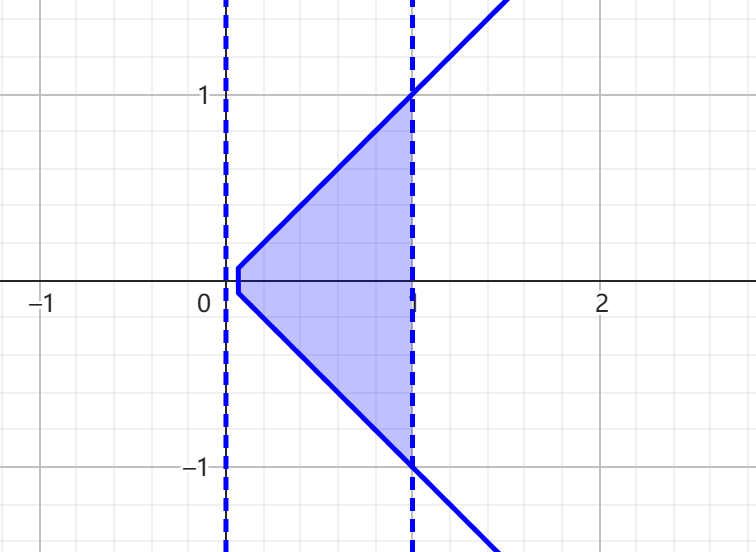
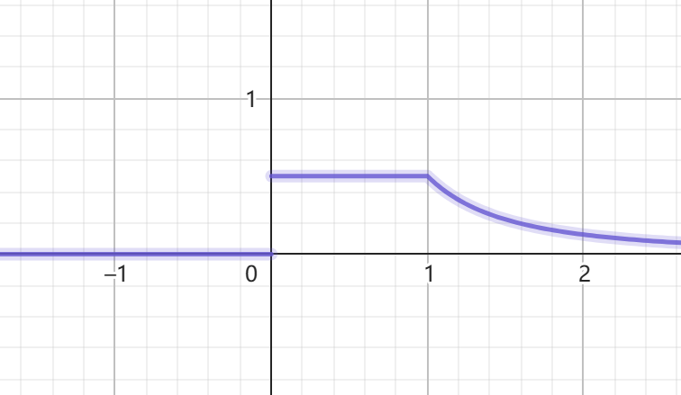

# 1

## (1)

$ P(X=0) = P(Y=0) = \frac56 $  
$ P(X=1) = P(Y=1) = \frac16  $

$ P(X=0,Y=0) = \frac{25}{36} $  
$ P(X=1,Y=1) = \frac{1}{36} $  
$ P(X=0,Y=1) = \frac{5}{36} $  
$ P(X=1,Y=0) = \frac{5}{36} $

## (2)

$ P(X=0,Y=0) = \frac{10}{12} \times \frac{9}{11} = \frac{45}{66} $  
$ P(X=1,Y=1) = \frac{2}{12} \times \frac{1}{11} = \frac{1}{66} $  
$ P(X=0,Y=1) = \frac{10}{12} \times \frac{2}{11} = \frac{10}{66} $  
$ P(X=1,Y=0) = \frac{2}{12} \times \frac{1}{11} = \frac{1}{66} $

# 3

## (1)

$ \int_{-\infty}^{\infty} \int_{-\infty}^{\infty} f(x,y)dxdy=1 $  
$ \int_2^4 dy \int_0^2 k(6-x-y)dx = \int_2^4 [ k(6x -\frac12x^2 - yx) ]_0^2 dy = \int_2^4 k(12-2-2y) dy = k(10y - y^2)|_2^4 = 20k - 12 k = 1 $  
$ k = \frac18$

## (2)

$ P(X<1,Y<3) = \int_2^3dy \int_0^1 \frac18(6-x-y)dx = \frac18 \int_2^3 [ (6x -\frac12x^2 - yx) ]_0^1 dy = \frac18 \int_2^3 (\frac{11}{2}-y) dy = \frac18 (\frac{11}{2}y-\frac12 y^2)|_2^3 = \frac38 $

## (3)

$ P(X<1.5) = \int_2^4 dy \int_{0}^{1.5} \frac18(6-x-y)  = \frac18 \int_2^4 [ (6x -\frac12x^2 - yx) ]_0^{1.5} dy = \frac 18\int_2^4(\frac{63}{8} - \frac{3}{2}y)dy = \frac18 (\frac{63}{8}y-\frac{3}{4}y^2)|_2^4 = \frac{27}{32} $

## (4)

$\Sigma = \{ 0 \leq x \leq 2, 2\leq y \leq 4 , x+y \leq 4 \} $

$ P(X+Y \leq 4) =\underset{\Sigma}{\iint} f(x,y) dxdy = \frac18 \int_2^4dy \int_0^{4-y}(6-x-y)dx = \frac18 \int_2^4 [ (6x -\frac12x^2 - yx) ]_0^{4-y} dy = \frac18 \int_2^4[6(4-y)-\frac12(4-y)^2 - y(4-y)] = \frac18 \int_4^2[2(4-y) + \frac12(4-y)^2]dy = \frac18 = [-(4-y)^2 - \frac16(4-y)^3]_2^4 =\frac{2}{3}  $

# 7

<!-- $ G = \{x \leq x \leq 1 , 0 \leq y \leq x \} $  
$ \underset G \int f(x,y)ds $ -->

$ f_x(x)=\int_{-\infty}^{\infty}f(x,y)dy = \int_0^x 4.8y(2-x)dy = 2.4(2-x)x^2  $  
$ f_y(y)=\int_{-\infty}^{\infty}f(x,y)dx = \int_y^1 4.8y(2-x)dx = 9.6 xy - 2.4 y x^2|_y^1 =2.4y(3-4y+y^2)  $  

$ f_x(x) = \begin{cases}
2.4(2-x)x^2 & 0 \leq x \leq 1 \\
0 
\end{cases} $

$ f_y(y) = \begin{cases}
2.4y(3-4y+y^2) & 0 \leq y \leq 1 \\
0 
\end{cases} $

# 8

$ f_x(x) = \int_x^{\infty} e^{-y}dy = -e^{-y}|_x^{\infty} = e^{-x} $  
$ f_y(y) = \int_0^y e^{-y}dx=xe^{-y}|_0^y = ye^{-y} $

$ f_x(x) = \begin{cases}
e^{-x} & 0 < x  \\
0 
\end{cases} $

$ f_y(y) = \begin{cases}
ye^{-y} & 0 < y \\
0 
\end{cases} $

# 9

## (1)

$ \int_{-\infty}^{\infty}\int_{-\infty}^{\infty} f(x,y)dxdy = c \int_{-1}^1x^2dx \int_{x^2}^1ydy = c\int_{-1}^1x^2 \times \frac12y^2|_{x^2}^1 dx = \frac12c\int_{-1}^1 x^2(1-x^4)dx = \frac12c (\frac{x^3}{3}-\frac{x^7}{7})|_{-1}^{1} = \frac{4c}{21} $  
$ c = \frac{21}{4} $

## (2)

$\int_{x^2}^1 \frac{21}{4}x^2ydy = \frac{21}{8}x^2y^2|_{x^2}^1 = \frac{21}{8}x^2(1-x^4) $  
$ \int_{-\sqrt y}^{\sqrt y} \frac{21}{4}x^2ydx = \frac{7}{4}x^3y|_{-\sqrt y}^{\sqrt y} =\frac{7}{2} y^{\frac52} $

$ f_x(x) = \begin{cases}
\frac{21}{8}x^2(1-x^4) & -1 \leq x \leq 1   \\
0 
\end{cases} $

$ f_y(y) = \begin{cases}
\frac{7}{2} y^{\frac52} & 0 \leq y \leq 1 \\
0 
\end{cases} $

# 10

## (1)

$ P(X = i) = \sum_{j=51}^{55} P(i,j) $

|X|51|52|53|54|55|
|-|-|-|-|-|-|
|P|0.28|0.28|0.22|0.09|0.13|

$ P(Y = j) = \sum_{i=51}^{55} P(i,j) $

|Y|51|52|53|54|55|
|-|-|-|-|-|-|
|P|0.18|0.15|0.35|0.12|0.20|

## (2)

$ P(Y=j \mid X=51) = \frac{ P(X=51,Y=j) }{ P(X=51) } $  

|Y|51|52|53|54|55|
|-|-|-|-|-|-|
|P|$\frac{6}{28}$|$\frac{7}{28}$|$\frac{5}{28}$|$\frac{5}{28}$|$\frac{5}{28}$|

# 13

## (1)

$f_{X \mid Y}(x \mid y) = \frac{f_{X,Y}(x,y)}{f_Y(y)} = \begin{cases} \frac32 x^2y^{-\frac32} & -\sqrt y \leq x \leq \sqrt y   \\
0 
\end{cases}$  

$f_{X \mid Y}(x \mid y = \frac12)  = \begin{cases} 3\sqrt 2 x^2 & -\frac{\sqrt 2}{2} \leq x \leq \frac{\sqrt 2}{2}   \\
0 
\end{cases}$   

## (2)

$f_{Y \mid X}(y \mid x) = \frac{f_{X,Y}(x,y)}{f_X(x)} = \begin{cases} \frac{2y}{1-x^4} & x^2 \leq y \leq 1   \\
0 
\end{cases}$  

$f_{Y \mid X}(y \mid x=\frac13) = \frac{f_{X,Y}(x,y)}{f_X(x)} = \begin{cases} \frac{81}{40}y & \frac19 \leq y \leq 1   \\
0 
\end{cases}$  

$f_{Y \mid X}(y \mid x = \frac12) = \frac{f_{X,Y}(x,y)}{f_X(x)} = \begin{cases} \frac{32}{15}y & \frac14 \leq y \leq 1   \\
0 
\end{cases}$  

## (3)

$ P(Y \geq \frac 14 \mid X=\frac12) = \int_{\frac14}^{1} f_{Y \mid X}(y \mid x = \frac12)dy = 1 $  
$ P(Y \geq \frac 34 \mid X=\frac12) = \int_{\frac14}^{1} f_{Y \mid X}(y \mid x = \frac12)dy = \frac{7}{15} $

# 14

$f_X(x) = \int_{-x}^{x}1dy = 2x , 0<x<1 $  
$ f_Y(y) = \begin{cases} 
\int_y^11dx=1-y & 0 < y <1 \\
\int_{-y}^11dx=1+y & -1 < y \leq 0 \\
0 
\end{cases} $  

$ f_{X \mid Y}(x \mid y) = \begin{cases} 
\frac{1}{1-|y|} & |y| < x < 1 \\
0 
\end{cases} $

$ f_{Y \mid X}(y \mid x) = \begin{cases} 
\frac1{2x} & |y| < x \\
0 
\end{cases} $

# 15

## (1)

$f(x,y) = f_{Y \mid X}(y \mid x)f_X(x) $  
$f(x,y) = \begin{cases} 
x & 0 < y < \frac1x,0<x<1 \\
0 
\end{cases} $

## (2)

$ f_Y(y) = \int_{-\infty}^{\infty} f(x,y)dx = \begin{cases} 
\frac12 & 0 < y < 1 \\
\frac{1}{2y^2} & 1 \leq y \\
0 
\end{cases} $

## (3)

$ P(X>Y) = \int_0^1dy \int_y^1xdx= \int_0^1 \frac12(1-y^2)dy = \frac13 $

# 21

## (1)

$ f_Z(z)=\int_{-\infty}^{\infty} f(x,z-x)dx = \begin{cases} 
z^2 & 0 < z < 1 \\
2z-z^2 & 1 \leq y < 2 \\
0 
\end{cases} $

## (2)

$ f_Z(z) = \int_{-\infty}^{\infty} \frac{1}{|x|} f(x,\frac zx) dx= \begin{cases} 
2(1-z) & 0 < z < 1 \\
0 
\end{cases} $

# 24

## (1)

$ f_X(x) = \int_{-\infty}^{\infty} f(x,y)dy = \int_0^{\infty} \frac12(x+y)e^{-(x+y)}dy = \frac12(x+y)[-e^{-(x+y)}]_0^{\infty} + \frac12 \int_0^{\infty} e^{-(x+y)}dy = \frac12xe^{-x}-\frac12e^{-(x+y)}|_0^{\infty} = \frac{x+1}2e^{-x} $

$ f_X(x) = \begin{cases} 
\frac{x+1}{2}e^{-x} & 0<x \\
0 
\end{cases} $

同理：  
$ f_Y(y) = \begin{cases} 
\frac{y+1}{2}e^{-y} & 0<y \\
0 
\end{cases} $

因为 $f_X(x)f_Y(y) \neq f(x,y) $所以，XY不独立

## (2)

$ f_Z(z) = \int_{-\infty}^{\infty} f(z-y,y)dy $  
$ f_Z(z) = \begin{cases} 
\frac{1}{2}ze^{-z}dy & 0<z \\
0 
\end{cases} $

# 26

$ f_Z(z) = \int_{-\infty}^{\infty} |x|f_X(x)f_Y(xz)dx = \int_0^{\infty}xe^{-x}e^{-xz}dx = \frac{1}{(z+1)^2} $  
$ f_Z(z) = \begin{cases} 
\frac{1}{(z+1)^2} & 0 < z \\
0 \geq z
\end{cases} $

# 30

$ P(X \leq 180 ) = P(\frac{X-160}{20} \leq \frac{180-160}{20}) = \Phi(\frac{180-160}{20}) = \Phi(1) = 0.841 $

$ P = \prod_1^4(1-P_i) =(1 - 0.8413)^4 = 0.00063 $

# 34

$ P(X=k) = \frac{\lambda _1 ^{k}e^{-\lambda _1}}{k!} $  

$ f(Z) = f(X) \ast f(Y) $  
$ P(Z=i) = \sum_{k=0}^{i} \frac{ \lambda _1 ^{k}e^{-\lambda _1}}{k!} \frac{ \lambda _2 ^{i-k}e^{-\lambda _2}}{(i-k)!} = \frac{\lambda _1 ^k \lambda _2 ^{i-k}e^{-(\lambda _1+\lambda _2)}}{k!(i-k)!} $  
$ =\frac{e^{-(\lambda _1+\lambda _2)}}{i!} \sum_{k=0}^{i} \frac{i!}{k!(i-k)!}\lambda _1 ^k \lambda _2 ^{i-k} $  
$ =\frac{e^{-(\lambda _1+\lambda _2)}}{i!} \sum_{k=0}^{i} \binom{i}{k}\lambda _1 ^k \lambda _2 ^{i-k} $  
$ =\frac{e^{-(\lambda _1+\lambda _2)}}{i!} (\lambda _1+\lambda _2 )^i $  
即$ Z \sim \pi(\lambda _1+\lambda _2) $

# 36

## (1)

$ P(Y=2) = \sum_0^5P(X=i,Y=2) =0.25  $  
$ P(X=0) = \sum_0^3P(X=0,Y=i) = 0.03 $

$ P(X=2 \mid Y=2) = \frac{P(X=2,Y=2)}{P(Y=2)} = \frac{0.05}{0.25} = \frac15 $  
$ P(Y=3 \mid X=0) = \frac{P(X=0,Y=3)}{P(X=2)} = \frac{0.0.1}{0.03} = \frac13 $

## (2)

$ V=max(X,Y) $

|$V=max(X,Y)$|0|1|2|3|4|5|
|:-:|-|-|-|-|-|-|
|$P$|0|0.04|0.16|0.28|0.24|0.28|

## (3)

$ U=min(X,Y) $

|$U=min(X,Y)$|0|1|2|3|
|:-:|-|-|-|-|
|$P$|0.28|0.30|0.25|0.17|

## (4)

$ W = X + Y $

$ P(W) =f_X(x) \ast f_Y(y) $  
$ P(W = i) = \sum_{k=0}^{i} P(X=k,Y=i-k) $

|$W = X + Y $|0|1|2|3|4|5|6|7|8|
|:-:|-|-|-|-|-|-|-|-|-|
|$P$|0|0.02|0.06|0.13|0.19|0.24|0.19|0.12|0.05|

 